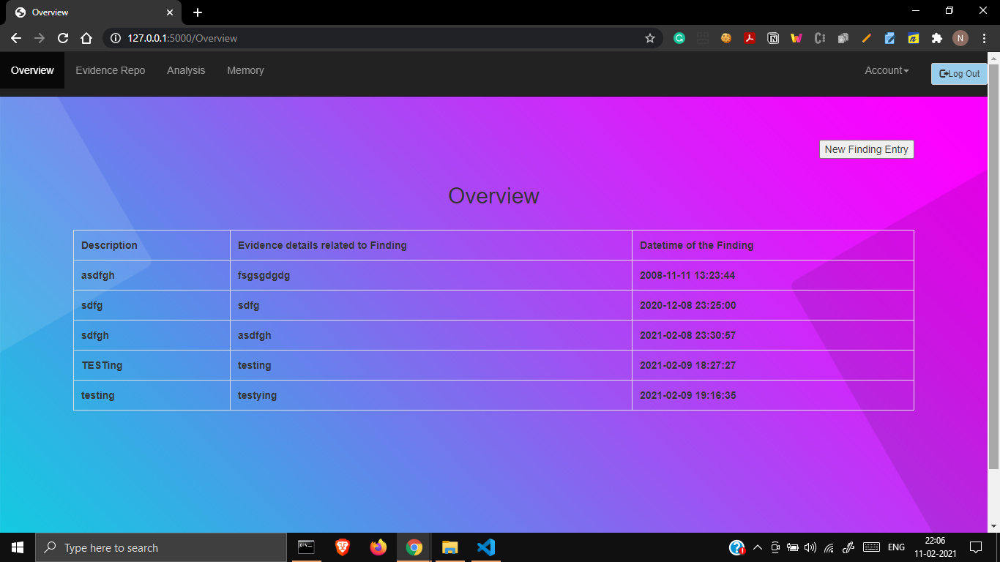
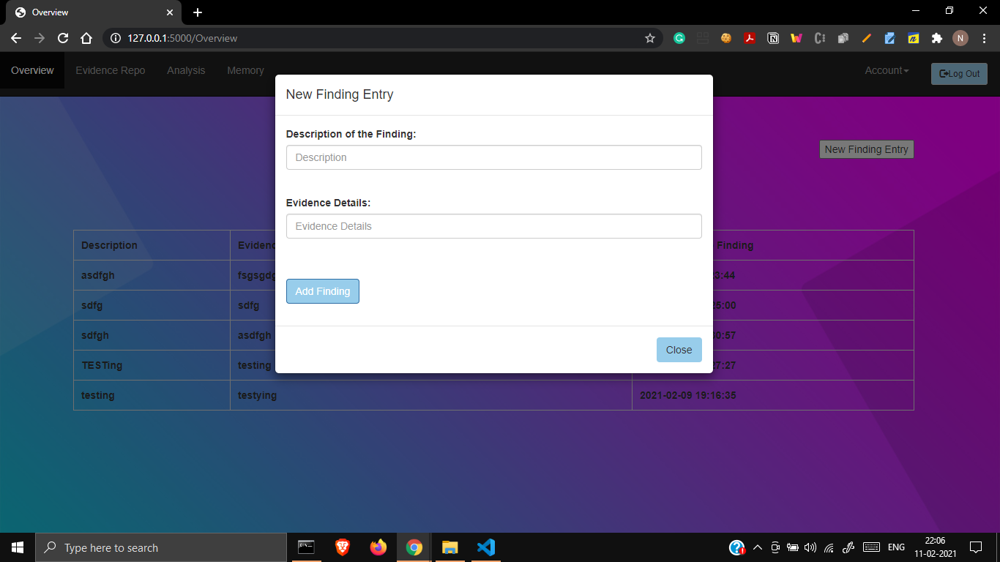
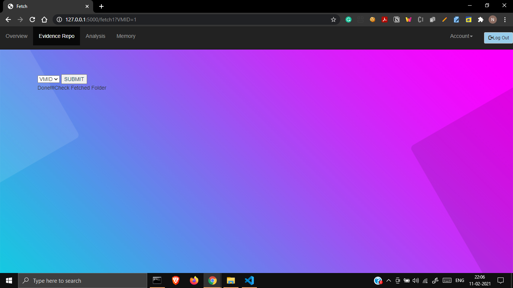
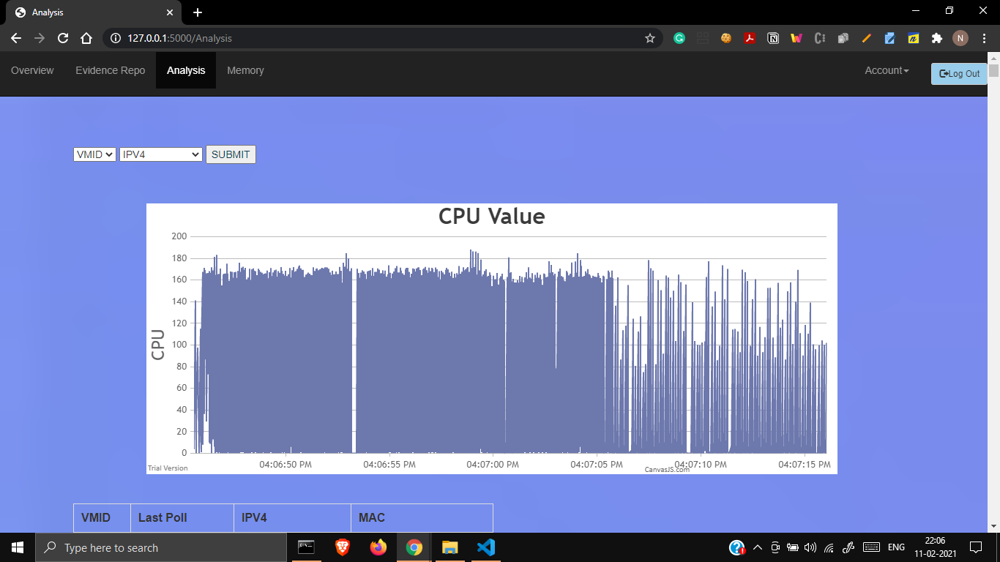
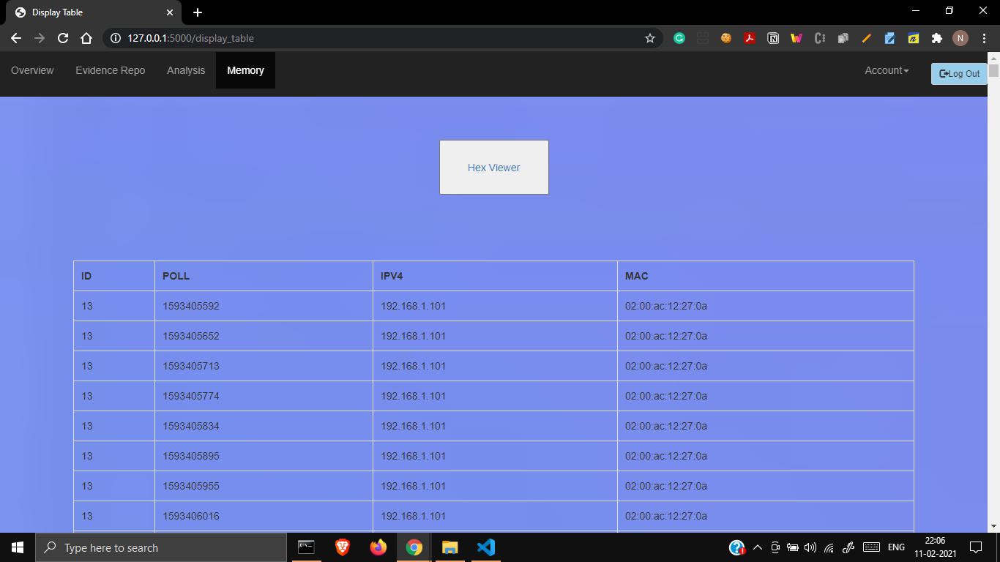
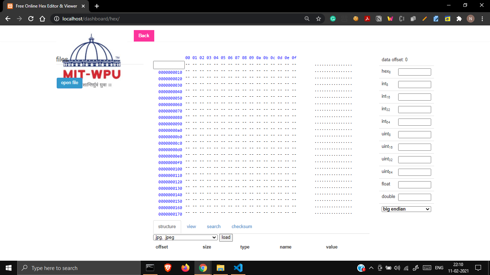

# BTech Final Year Project

A web application designed to manage and analyze digital evidence for forensic purposes.

## Table of Contents
- [Installation](#installation)
- [Usage](#usage)
- [Screenshots](#screenshots)
- [Features](#features)
- [Technologies Used](#technologies-used)
  
## Installation

### Prerequisites
- Python
- pip

### Steps
1. Install Flask:
    ```sh
    pip install flask
    ```
2. Install MySQL:
    ```sh
    pip install flask-mysqldb
    ```
3. Navigate to the project directory.
4. Set environment variables:
    ```sh
    set FLASK_APP=app.py
    set FLASK_ENV=development
    set FLASK_DEBUG=1
    ```
5. Run the application:
    ```sh
    flask run
    ```
6. Open the provided URL in your browser.

## Usage

- Ensure the debug mode is enabled for proper CSS functionality.
- Copy the URL from the command line output and paste it into your browser to access the app.
  

## Screenshots

### 1. Login Page


### 2. Load Case Page


### 3. New Case Page


### 4. Overview


### 5. Finding New Entry


### 6. Evidence Repo


### 7. Analysis


### 8. Memory View


### 9. Hex View


## Features

- User authentication and case management.
- Digital evidence storage and analysis.
- Memory and hex view functionalities.

## Technologies Used

- Flask
- MySQL
- HTML/CSS
- JavaScript
