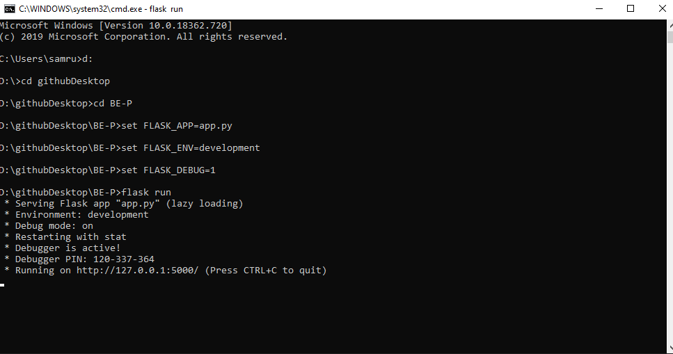
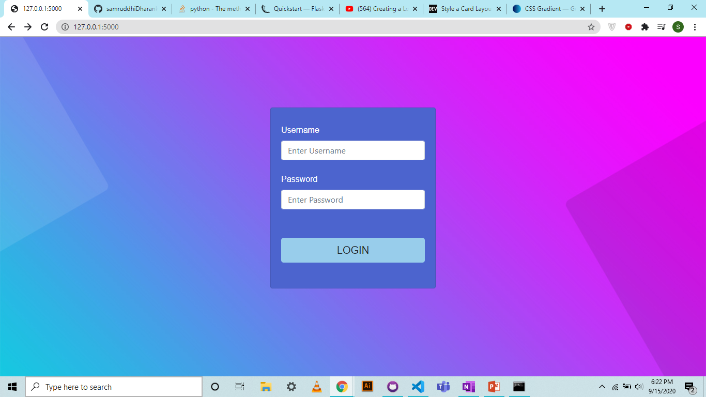
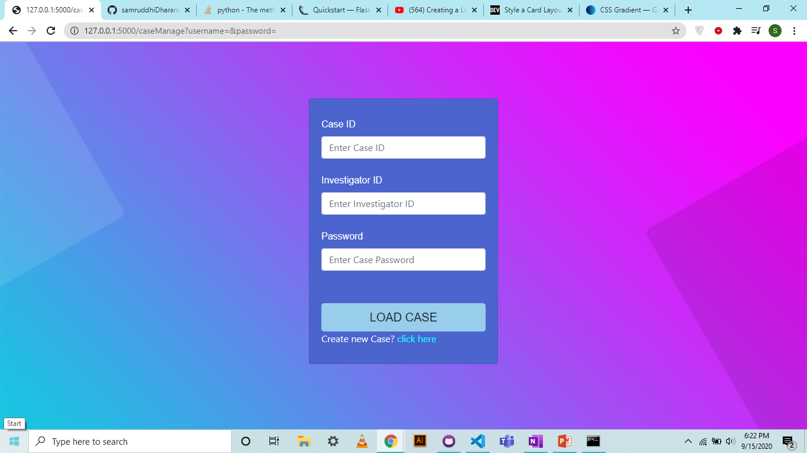
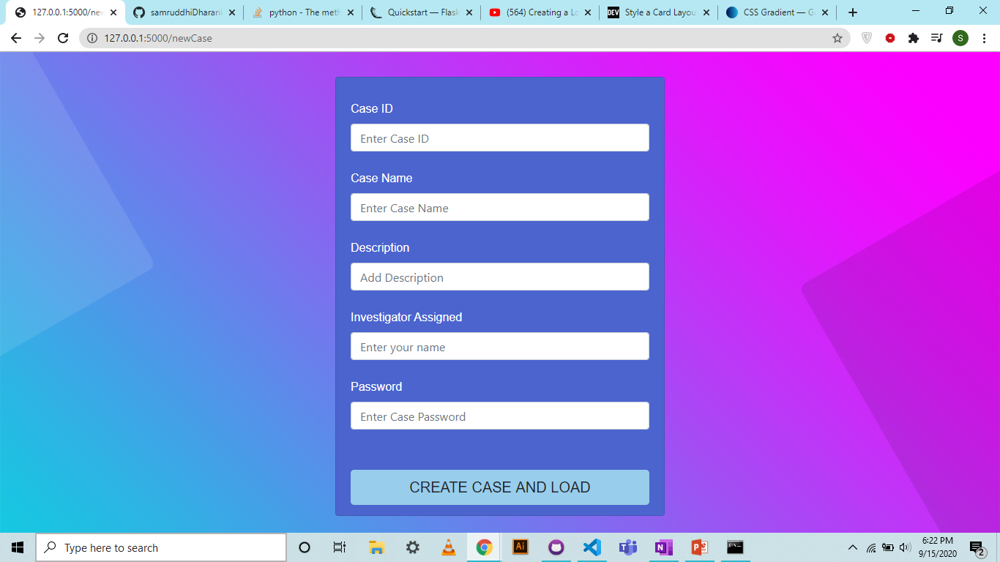

## INSTALLATION
### Prerequisites
**Python**
<br />

1. pip
    ```bash
    pip install pip
    ```
2. Flask
    ```bash
    pip install flask
    ```
3. Mysql
    ```bash
    pip install flask-mysqldb
    ```
4. Go to the folder where you downloaded the project file

5. Then run once
    ```bash
    set FLASK_APP=app.py
    ```
    ```bash
    set FLASK_ENV=development
    ```
    ```bash
    set FLASK_DEBUG=1
    ```
6. To run the app
    ```bash
    flask run
    ```
    
    
    **MAKE SURE THAT DEBUG MODE IS ON ELSE THE CSS WILL NOT WORK**
7. Copy the url from the command line and paste it in chrome

<br />

**SCREENSHOTS**
1. Login Page
    
    <br />
2. Load Case Page
    
    <br />
3. New Case Page
    
    <br />
